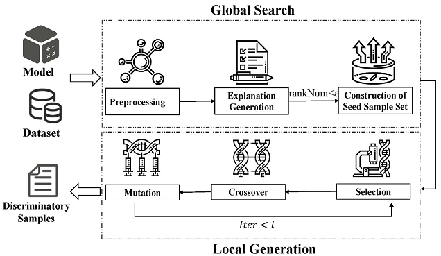
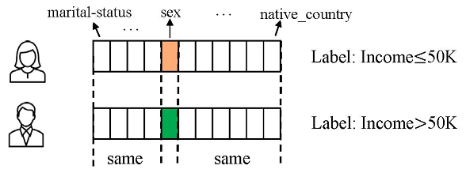

# ExpGA
ExpGA is an explanation-guided fairness testing approach through a genetic algorithm(GA).ExpGA employs the explanation results generated by interpretable methods to collect high-quality initial seeds, which are prone to derive discriminatory samples by slightly modifying feature values.

# Examples

- **Tabular Data**

Here we present a discriminatory sample on the Census dataset. The only difference between the two samples is their values of sex feature, which is related to the protected attribute gender, indicating the unfairness of the classifier with regard to gender.

- **Textual Data**

Here we present a generated discriminatory sample on the IMDB dataset. Given the gender as the protected attribute, a pair of sentences on IMDB datasets in the following is discriminatory samples on the original CNN model, we add “male” and “female” before “master” in two sentences respectively, the predicted labels are different, the sentence with “male master” is positive, while sentence with “female master” is negative.

*… Robertson is a male master of pace, camera, angles and montage…*

*… Robertson is a female master of pace, camera, angles and montage…*

After the model retraining, both sentences are predicted as positive on the new CNN model.

# Implementation Notes

1.Environmental Setup:

`pip install -r requirement.txt`
